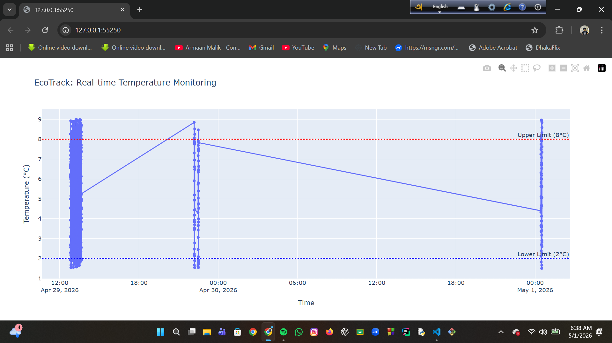
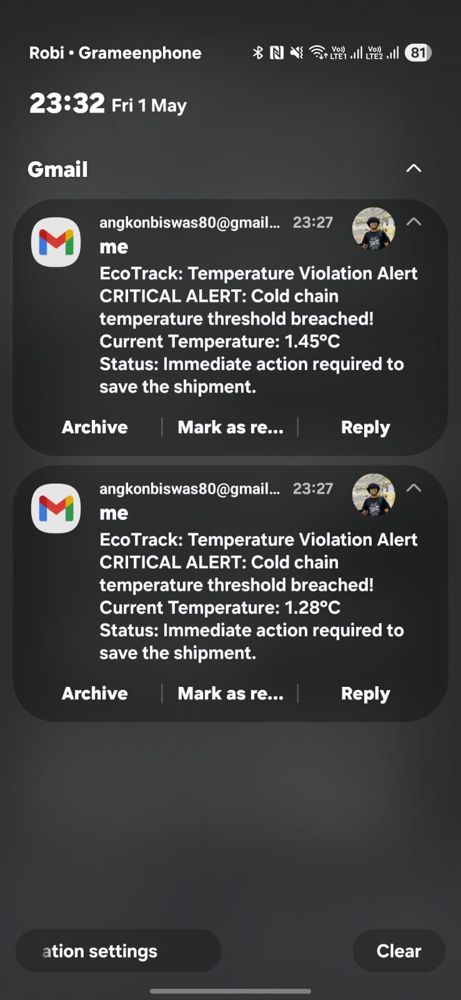
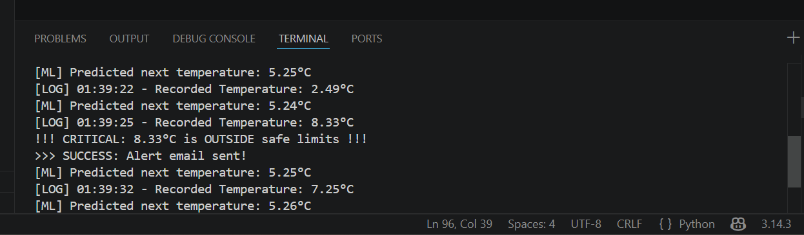
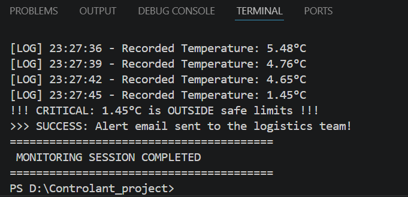

# ❄️ EcoPredict IoT: Advanced Cold Chain Logistic Simulator with Smart Temperature Prediction.

EcoTrack is a professional monitoring system designed for cold chain management in the pharmaceutical and food industries. Inspired by logistics leaders like **Controlant**, this project ensures the safety of sensitive products during transit through real-time data visualization and automated alerts.

## 🚀 Key Features
- **Real-time Visualization:** Generates dynamic temperature graphs using Plotly to monitor trends against safety thresholds.
- **Automated Alerts:** Triggers instant email notifications via SMTP if the temperature breaches the safe range (2°C - 8°C).
- **Database Integration:** Stores every temperature reading and timestamp in an SQLite database for comprehensive audit trails.
- **Secure Configuration:** Protects sensitive credentials (emails, passwords) using environment variables (`.env`).

- **ML-Powered Prediction:** Uses Linear Regression to predict the next temperature 
reading from historical data, enabling proactive alerts before a threshold breach occurs.

## 📊 System Overview

### 1. Temperature Analysis Graph
The system visualizes fluctuations and highlights the safe operational zones:
 
*(Note: Please rename your graph image to 'graph_screenshot.png' in your folder)*

### 2. Instant Email Alert
A sample of the automated emergency notification sent by the system:
 

### 3. ML Temperature Prediction
The system uses Machine Learning (Linear Regression) to analyze historical temperature 
data and predict the next reading in real-time, allowing early intervention before 
a critical breach occurs.



## 🔍 System Demonstrations

To ensure reliability, the system has been tested under various conditions. Below are the visual proofs of the system in action:

### 1. Real-time Temperature Visualization
The following graph illustrates how the system tracks temperature against the safety thresholds (2°C and 8°C).


### 2. Automated Trigger & Terminal Success
This screenshot shows the system identifying a temperature breach and successfully triggering the SMTP alert protocol.


### 3. Mobile Alert Notification
The final result: an instant emergency notification received on a mobile device, ensuring logistics managers can react immediately.


## 🛠️ Tech Stack
- **Language:** Python
- **Libraries:** Plotly, Pandas, Python-dotenv
- **Database:** SQLite
- **Communication:** SMTP (Gmail API)
- **Version Control:** Git & GitHub
- **ML Library:** Scikit-learn (Linear Regression)
- **Data Processing:** NumPy

## 📦 Installation & Setup
1. Clone this repository.
2. Install the required packages:
   ```bash
   python -m pip install -r requirements.txt